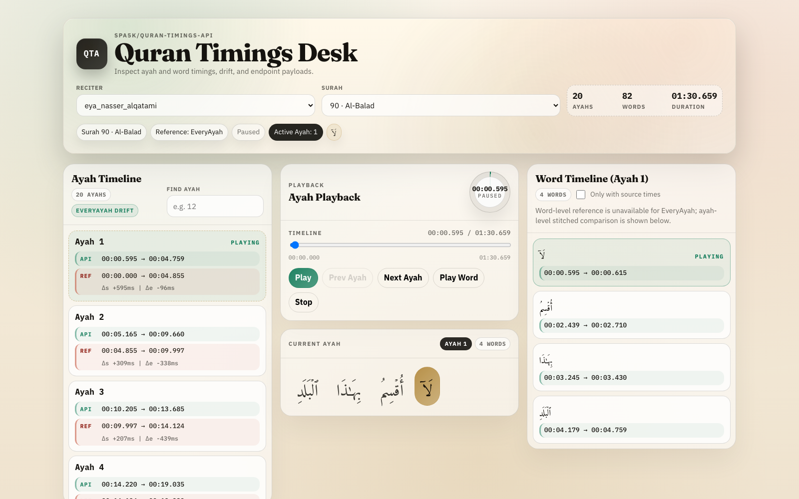

# Quran Audio Timings API and CLI

In the name of Allah, the Entirely Merciful, the Especially Merciful.

This repository provides a public Quran recitation timings dataset (ayah + word timings) and a CLI to generate/refresh the data.

## Features

- Free static JSON API (CDN-friendly)
- No app-level authentication or rate limits
- Reciter metadata + per-surah timing endpoints
- CLI pipeline to run alignment and publish updated timing files

## UI Screenshots

### Overview (Desktop)



## Public API

URL structure:

```text
https://cdn.jsdelivr.net/gh/spa5k/quran-timings-api@{version}/data/{endpoint}
```

Versioning:

- `@main` for latest branch
- `@v1`, tags, or commit hash for pinned versions

Base URLs:

- JSDelivr: `https://cdn.jsdelivr.net/gh/spa5k/quran-timings-api@main/data`
- GitHack: `https://rawcdn.githack.com/spa5k/quran-timings-api/main/data`
- Statically: `https://cdn.statically.io/gh/spa5k/quran-timings-api/main/data`
- GitHub Raw: `https://raw.githubusercontent.com/spa5k/quran-timings-api/main/data`
- GitLoaf: `https://gitloaf.com/cdn/spa5k/quran-timings-api/main/data`

### Self-hosting (recommended)

You can and should download `data/api` and host it yourself (instead of depending only on public CDNs).

Required files to host:

- `data/reciters.json`
- `data/api/**`

Quick start:

```bash
git clone --depth 1 https://github.com/spa5k/quran-timings-api.git
cd quran-timings-api
```

Then upload/serve the `data/` folder from your own static hosting (Nginx, Cloudflare R2, S3, etc.).

### Cloudflare Worker build note

For the `ui/` Cloudflare Worker setup, the build pipeline automatically syncs repo `data/` API files into `ui/public/data` during build (`prepare-api-data.mjs`).  
This now runs via npm lifecycle hooks and Wrangler build command, so `wrangler dev` / `wrangler deploy` include fresh data without a manual copy step.

### Endpoints

1. `/reciters.json`  
   List reciters, source pools, and counts.

   Example:  
   `https://cdn.jsdelivr.net/gh/spa5k/quran-timings-api@main/data/reciters.json`

2. `/api/reciters/{slug}/metadata.json`  
   Reciter-level metadata + available surahs.

   Example:  
   `https://cdn.jsdelivr.net/gh/spa5k/quran-timings-api@main/data/api/reciters/eya_yasser_ad_dussary_128kbps/metadata.json`

3. `/api/reciters/{slug}/surahs/{surah}/metadata.json`  
   Surah-level metadata (counts, duration, audio contract).

   Example:  
   `https://cdn.jsdelivr.net/gh/spa5k/quran-timings-api@main/data/api/reciters/eya_yasser_ad_dussary_128kbps/surahs/114/metadata.json`

4. `/api/reciters/{slug}/surahs/{surah}/timings.json`  
   Ayah and word timing payload.

   Example:  
   `https://cdn.jsdelivr.net/gh/spa5k/quran-timings-api@main/data/api/reciters/eya_yasser_ad_dussary_128kbps/surahs/114/timings.json`

### Quick API usage

```bash
curl -s https://cdn.jsdelivr.net/gh/spa5k/quran-timings-api@main/data/reciters.json | jq '.counts'
```

```bash
curl -s https://cdn.jsdelivr.net/gh/spa5k/quran-timings-api@main/data/api/reciters/eya_muhsin_al_qasim_192kbps/surahs/113/timings.json | jq '.ayahs[0]'
```

### Sample `timings.json`

Current `timings.json` payloads are intentionally lean:

- `ayahs[]` keeps `surah`, `ayah`, `start_s`, `end_s`, and optional ayah audio fields
- `words[]` keeps core word indexes, text, and timings

Example from `data/api/reciters/eya_yasser_ad_dussary_128kbps/surahs/114/timings.json`:

```json
{
  "schema_version": "v2",
  "reciter_slug": "eya_yasser_ad_dussary_128kbps",
  "surah": 114,
  "ayahs": [
    {
      "surah": 114,
      "ayah": 1,
      "start_s": 0.0,
      "end_s": 2.24,
      "audio_asset": "everyayah_ayah",
      "audio_key": "001",
      "audio_url": "https://everyayah.com/data/Yasser_Ad-Dussary_128kbps/114001.mp3"
    }
  ],
  "words": [
    {
      "surah": 114,
      "ayah": 1,
      "word_index_global": 1,
      "word_index_in_ayah": 1,
      "text_uthmani": "قُلۡ",
      "text_norm": "قل",
      "start_s": 0.0,
      "end_s": 0.08
    },
    {
      "surah": 114,
      "ayah": 1,
      "word_index_global": 2,
      "word_index_in_ayah": 2,
      "text_uthmani": "أَعُوذُ",
      "text_norm": "اعوذ",
      "start_s": 0.4,
      "end_s": 0.96
    }
  ]
}
```

## Available Reciters

Snapshot below is from `data/reciters.json` generated on `2026-03-10`.

### Newly enabled reciters (added on 2026-03-07)

- `qcom_abdulbaset_abdulsamad`
- `qcom_abdur_rahman_as_sudais`
- `qcom_abu_bakr_al_shatri`
- `qcom_hani_ar_rifai`
- `qcom_mahmoud_khalil_al_husary`
- `eya_abdul_basit_murattal`
- `eya_abdul_basit_mujawwad`
- `eya_abdullah_basfar`
- `eya_abdurrahmaan_as_sudais`
- `eya_abdulsamad_quranexplorer_com`

### Source coverage and rollout

- `data/reciters.json` is filled with reciters sourced from:
  - Quran.com
  - EveryAyah
  - Quranicaudio.com
- Source lists are published in the reciter index (for example: `everyayah_reciters`, `quran_com_reciters`), and timing coverage is being added gradually.
- Surah timings are published incrementally per reciter (surah-by-surah), so `surahs_available` grows over time as new timings are contributed.

## Run the CLI Locally

### Prerequisites

- Python `3.12+`
- [`uv`](https://docs.astral.sh/uv/)

### Install and run

```bash
git clone https://github.com/spa5k/quran-timings-api.git
cd quran-timings-api
uv sync
uv run qad --help
```

Optional extras:

```bash
uv sync --extra dev   # tests/lint
uv sync --extra cpu   # CPU alignment deps
uv sync --extra gpu   # GPU alignment deps
uv sync --extra mfa   # Montreal Forced Aligner
```

If you want `qad` directly in your active environment:

```bash
uv venv
source .venv/bin/activate
uv pip install -e .
qad --help
```

### Main commands

```bash
uv run qad sync-reciters
uv run qad list-reciters --enabled-only
uv run qad detect
uv run qad detect --audio-url <https_audio_url> --reciter-id eya_yasser_ad_dussary_128kbps --surah 114
```

Use `sync-reciters` to refresh the public reciter catalog from EveryAyah and Quran.com.
Use `list-reciters` to inspect the current catalog and enabled set.
Running `uv run qad detect` with no flags opens an interactive prompt to choose or add a reciter, enter the surah, optional ayah, and the audio URL.
Running `detect` for a full surah automatically updates `data/api/` and `data/reciters.json`.
Ayah-only clips stay as local detect runs and are not published into the surah-level API contract.

Non-interactive full-surah example:

```bash
uv run qad detect \
  --reciter-id eya_yasser_ad_dussary_128kbps \
  --surah 114 \
  --audio-url <https_audio_url>
```

## Contribute Your Timings

Contributions for new or improved timings are welcome.

1. Refresh the public reciter catalog if needed:

```bash
uv run qad sync-reciters
```

2. Review available reciters if needed:

```bash
uv run qad list-reciters --enabled-only
```

3. Start the interactive detect flow and enter the reciter, surah, optional ayah, and audio URL.

```bash
uv run qad detect
```

If you want to skip prompts, run `detect` directly:

```bash
uv run qad detect --audio-url <https_audio_url> --reciter-id <reciter_slug> --surah <1-114>
```

4. Full-surah detect runs publish automatically into `data/api/` and update `data/reciters.json`.
   Ayah-only detect runs stay under `runs/detect/` and do not overwrite the surah API.

5. Open a PR with updated files under:

- `data/api/reciters/...`
- `data/reciters.json` (if reciter metadata changed)

6. Include what changed in the PR description:

- Reciter slug(s)
- Surah number(s)
- Any source/audio notes

## Development / Tests

```bash
uv run --extra dev pytest -q
```

## Share

Please share the project and star the repository if it helps you.
